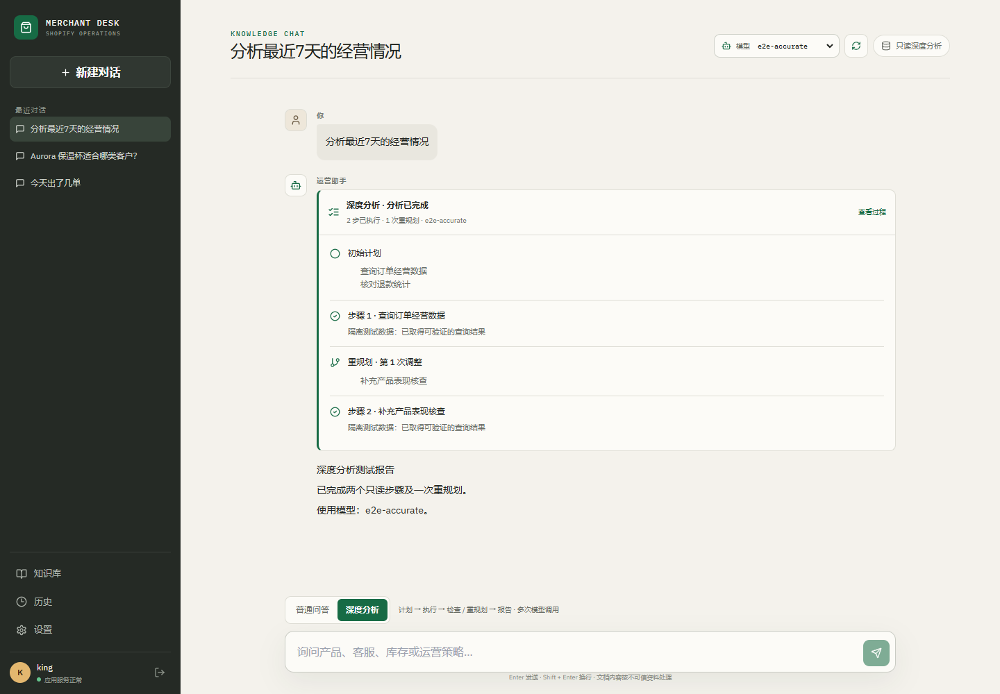
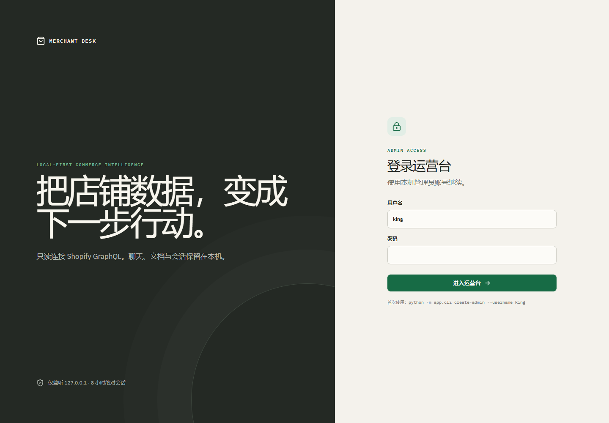
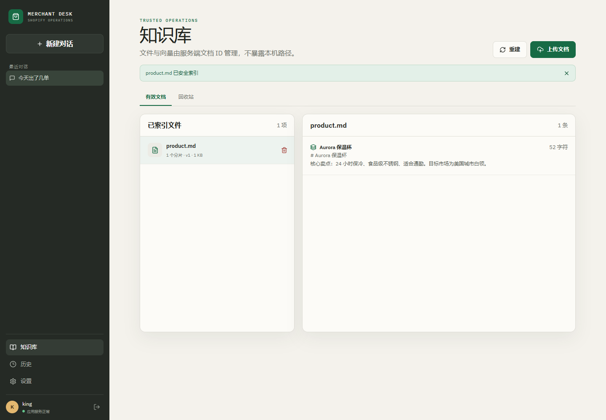
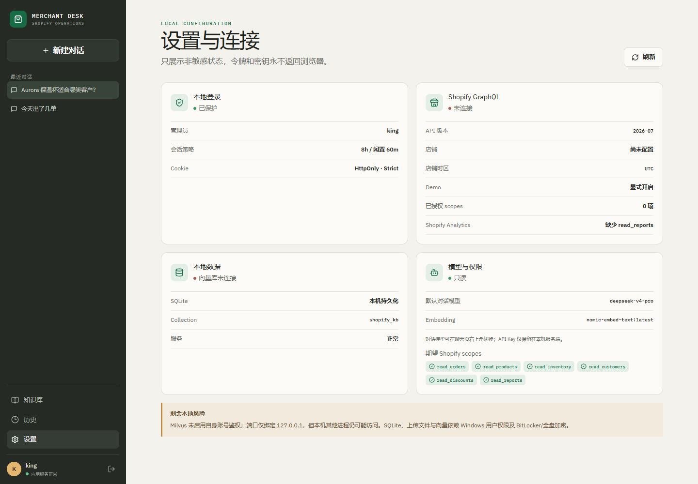
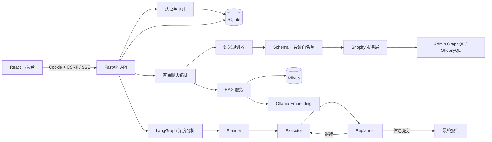

# Shopify AI Assistant

[](https://github.com/Kingfangpeng/shopify-ai-assistant/actions/workflows/ci.yml)


一个本地优先、只读安全、过程可追溯的 Shopify 商家运营智能体。它不只把问题交给大模型，而是先理解意图，再从受控工具中选择真实数据源；复杂问题可以进入 Planner → Executor → Replanner 循环，最终生成有依据的运营报告。

> 这是一个面向工程能力展示的单机项目：强调 Agent 编排、Shopify GraphQL 集成、RAG 生命周期、身份安全和可解释 UI。默认不监听公网，也不会用 Mock 数据冒充真实店铺结果。



## 项目亮点

- **语义优先的工具调度**：模型输出受 Pydantic Schema 约束的计划，服务端再校验只读工具白名单、调用数量和路由类型；不让模型直接拼接或执行任意 GraphQL。
- **真实多步 Agent 循环**：基于 LangGraph 实现 Planner → Executor → Replanner；可展示初始计划、执行步骤、重规划和最终报告，刷新后仍可回看过程。
- **17 个 Shopify 只读工具**：覆盖订单、周期对比、产品、库存、客户、退款、折扣、弃购、订单明细，以及 ShopifyQL 流量、来源、落地页、设备、地域、搜索和 Web 性能指标。
- **面向准确性的业务层**：日期按店铺 IANA 时区解析；金额、分页、节流、权限错误和数据来源统一处理；单指标查询优先使用确定性格式化，避免模型改写数字。
- **本地 RAG 与安全文件生命周期**：UTF-8/大小/扩展名校验、SHA-256 去重、失败保留旧版本、Milvus 向量检索、7 天回收站和恢复；文档始终作为不可信资料，不进入 system prompt。
- **完整的本地安全基线**：Argon2id、HttpOnly/SameSite=Strict Cookie、服务端会话、CSRF、Origin/Host 校验、登录限流、安全响应头和审计事件。
- **可用的产品界面**：模型选择、SSE 流式输出、工具轨迹、来源标识、停止/重试、会话持久化，以及桌面和移动端响应式布局。

## 核心演示

### 1. 计划、执行、检查与重规划

复杂经营问题可显式切换到“深度分析”。界面展示的是可审计的任务过程摘要，不是模型隐藏思维链；整个流程只注册只读工具。

### 2. 单管理员本地登录

管理员密码只保存 Argon2id 哈希；浏览器只有不透明的 HttpOnly Cookie，服务端只保存会话令牌哈希。



### 3. 知识库安全生命周期

上传后可以查看实际切片；删除进入 7 天回收站，恢复时重新索引。API 只接受服务端文档 ID，不接受任意本地路径。



### 4. 连接、权限与剩余风险可见

设置页只返回非敏感状态，集中展示 Shopify API 版本、授权 scopes、模型、Embedding、SQLite、Milvus 和本地风险，不会把令牌或 API Key 发到浏览器。



## 系统架构



关键边界：Shopify Client 只管理协议、分页和节流；Service 负责业务聚合；Tool 只做 Agent 适配。SQLite 保存用户、会话和文档元数据，Milvus 只保存向量，上传目录只保存源文件。

## Shopify 能力

| 类别 | 只读能力 | 数据接口 |
| --- | --- | --- |
| 经营 | 订单汇总、两个周期对比、订单列表 | Admin GraphQL |
| 商品 | 产品表现、库存与低库存 | Admin GraphQL |
| 客户 | 新老客、复购、国家分布 | Admin GraphQL |
| 售后与营销 | 退款、折扣、弃购 | Admin GraphQL |
| 店铺分析 | 流量概览、时间序列、来源、落地页、设备、地域、搜索、Web 性能 | ShopifyQL |

Shopify Admin API 固定为 `2026-07`，不使用会随时间变化的 `latest`。基础最小 scopes 为 `read_orders`、`read_products`、`read_inventory`、`read_customers`、`read_discounts`、`read_reports`；超过 60 天订单还需要 `read_all_orders`。ShopifyQL Analytics 需要店铺和应用具备相应报表及受保护客户数据资格。

## 技术栈

- 后端：Python、FastAPI、LangChain、LangGraph、Pydantic、httpx
- 数据：SQLAlchemy、Alembic、SQLite、Milvus、MinIO
- 模型：OpenAI-compatible API；支持本地 Ollama 模型与 Ollama Embedding
- 前端：React、Vite、React Router、React Markdown、IBM Plex 本地字体
- 质量：pytest、Vitest、Playwright、pip-audit、npm audit、Gitleaks、GitHub Actions

## 本地运行

### 前置条件

- Python 3.11–3.13
- Node.js 22+
- Docker Desktop（知识库需要）
- Ollama（使用本地模型或 Embedding 时需要）

### Windows

```powershell
Copy-Item .env.example .env
py -m pip install --user uv
py -m uv sync --group dev
Set-Location frontend
npm ci
Set-Location ..
docker compose -f vector-database.yml up -d
.\.venv\Scripts\alembic.exe upgrade head
.\.venv\Scripts\python.exe -m app.cli create-admin --username king
.\start-windows.bat
```

访问 `http://127.0.0.1:9901`。Linux/macOS 使用 `./start.sh`。应用默认只监听 `127.0.0.1`，请不要直接暴露到公网。

### 优先使用本地 Ollama

直接编辑项目根目录的 `.env`：

```dotenv
LLM_API_BASE=http://127.0.0.1:11434/v1
LLM_API_KEY=ollama-local
LLM_MODEL=qwen3.5:9b
RAG_MODEL=qwen3.5:9b
OLLAMA_BASE_URL=http://127.0.0.1:11434
OLLAMA_EMBEDDING_MODEL=nomic-embed-text:latest
EMBEDDING_DIMENSIONS=768
```

保存后重启应用。聊天页会读取当前 OpenAI-compatible 服务的模型列表，允许逐次选择；API Key 始终留在服务端。

### 接入 Shopify

在 Shopify 后台创建只读 Custom App，并在 `.env` 填写：

```dotenv
SHOPIFY_STORE_DOMAIN=your-store.myshopify.com
SHOPIFY_ACCESS_TOKEN=replace-with-read-only-token
SHOPIFY_API_VERSION=2026-07
SHOPIFY_DEMO_MODE=false
```

未配置真实凭据时返回“未连接”。只有显式设置 `SHOPIFY_DEMO_MODE=true` 才使用带 `source=demo` 标识的演示数据。

## 两种对话模式

- **普通问答**：模型理解问题并提交结构化路由，服务端验证后调用 0–4 个只读工具；适合“今天出了几单”“哪些商品卖得最好”“访客来自哪里”。
- **深度分析**：显式进入多步骤循环，适合“分析最近 7 天经营情况，结合订单、产品和退款给建议”。默认最多 8 步、3 次重规划、总时限 300 秒。

深度模式停止、切换会话或离开页面会取消当前流并保存中断状态；当前版本不做后台续跑或断点恢复。

## 测试与安全检查

```powershell
.\.venv\Scripts\pytest.exe tests\backend -q
.\.venv\Scripts\pip-audit.exe
Set-Location frontend
npm test
npm run build
npm run test:e2e
npm audit --audit-level=moderate
```

CI 还会扫描完整 Git 历史中的密钥。本项目的自动化测试使用隔离服务和合成数据，不访问真实 Shopify 店铺、Milvus 或外部大模型。

可选的真实模型兼容性测试会产生 API 用量，但仍使用合成数据：

```powershell
.\.venv\Scripts\python.exe -X utf8 scripts/smoke_ops_model.py --model deepseek-v4-flash
```

## 项目结构

```text
app/
  agent/                    语义规划与 Planner/Executor/Replanner
  api/                      HTTP/SSE、鉴权和错误映射
  auth/                     密码、会话、CSRF、限流
  db/                       SQLite 模型、迁移和仓储
  integrations/shopify/     GraphQL Client、查询与聚合服务
  services/                 聊天、知识库与 Agent 编排
  tools/                    只读 LangChain 工具适配
frontend/src/               React 运营台
tests/                      后端、前端与 E2E 测试
```

架构边界与取舍见 [PLAN.md](PLAN.md)，深度分析设计见 [docs/plans/2026-09-04-deep-analysis-design.md](docs/plans/2026-09-04-deep-analysis-design.md)，DeepSeek Flash 语义路由评估见 [docs/FLASH_EVALUATION.md](docs/FLASH_EVALUATION.md)，求职简历表述见 [docs/resume-project.md](docs/resume-project.md)。

## 当前边界

- 面向单机、单管理员、单 Shopify 店铺，不是多租户 SaaS。
- 所有 Shopify 工具只读；不会创建订单、修改库存或投放广告。
- Facebook/Google Ads 未接入并默认禁用。
- Milvus 未启用自身账号鉴权，但端口仅绑定 `127.0.0.1`；本机其他进程仍可能访问。
- SQLite、源文件和向量未做应用层静态加密，依赖 Windows 用户权限及 BitLocker/全盘加密。
- 当前仓库用于作品展示，尚未附加开源许可证。
